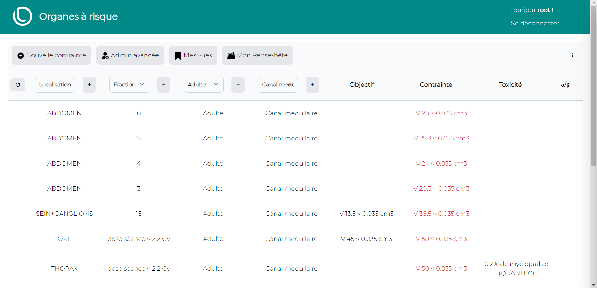

# OAR
> Application web de gestion des objectifs et contraintes sur les organes à risque, en radiotherapie.


<!-- TABLE DES MATIÈRES -->
<details open="open">
  <summary><h2 style="display: inline-block">Table des matières</h2></summary>
  <ol>
    <li>
      <a href="#a-propos-du-projet">A propos du projet</a>
    </li>
    <li>
      <a href="#installation">Installation</a>
      <ul>
        <li><a href="#avec-docker">Avec docker</a></li>
        <li><a href="#utiliser-la-base-de-données-oscar-lambret">Utiliser la base de données Oscar Lambret</a></li>
        <li><a href="#utiliser-ma-propre-base-de-données">Ne pas utiliser la base de données Oscar Lambret</a></li>
        <li><a href="#installation-legacy">Installation legacy</a></li>
      </ul>
    </li>
    <li><a href="#utilisation">Utilisation</a>
      <ul>
        <li><a href="#interface-web">Interface web</a></li>
        <li>
          <a href="#intégration-au-tps">Intégration au TPS</a>
        </li>
      </ul>
    </li>
    <li><a href="#architecture">Architecture</a></li>
    <li><a href="#contribution--contact">Contribution / Contact</a></li>
  </ol>
</details>


## A propos du projet
OAR a été développé dans l'objectif de remplacer les méthodes standards (pdf, excel...) de référencement des objectifs et contraintes sur les organes à risque en Radiothérapie. Les principes fondateurs du projet visent à simplifier la lecture et la modification de ces valeurs, tout en harmonisant leur utilisation. Le projet a été réalisé au  <a href="https://www.centreoscarlambret.fr/">Centre Oscar Lambret </a>. Une version de la base de données contenant nos objectifs et contraintes ainsi que les références scientifiques associées, est disponible avec le projet (voir <a href="#utiliser-la-base-de-données-oscar-lambret">Utiliser la base de données Oscar Lambret </a>).

<div style="display: flex; justify-content: center;">
    
</div>

## Installation
### Avec Docker
L'installation avec docker est recommandée, elle simplifie et uniformise l'installation. Docker permet aussi de pouvoir installer OAR très facilement sur n'importe quel système d'exploitation.
<br>
<ol>
<li>
Pour installer docker sur votre système, vous pouvez suivre la procédure par défaut <a href="https://www.docker.com/"> Docker</a>.
</li>
<li>
Clonez le projet
</li>

```
git clone https://github.com/ArthurRochette/OAR.git
```
<li>
    Par default OAR se lance sur le port 80 de votre machine, vous pouvez changer le port par défaut, ligne 6, dans docker-compose.yml (par exemple: 8000:80 pour lancer sur le port 8000).
</li>

<li>
Utilisez la commande compose à la racine du projet.
</li>

```
docker compose up -d 
```

<li>
Vous pouvez accéder à OAR dans votre navigateur avec <a href="http://localhost/">http://localhost/</a> ( ou  <a href="http://localhost:8000/">http://localhost:8000/</a> si vous avez mis le port 8000 )
</li>
</ol>


### Utiliser la base de données Oscar Lambret
Une version de la base de données utilisée au Centre Oscar Lambret se trouve dans le dossier oar/restore.<br> Lors de son premier lancement, le projet régénérera automatiquement la base de données. Un super utilisateur est présent, avec l'identifiant "root" et le mot de passe par défaut "toor".

### Utiliser ma propre base de données 
Si vous ne voulez pas l'utiliser, vous pouvez retirer la sauvegarde du dossier oar/restore avant de démarrer le serveur. Si vous avez besoin mettre à zéro votre base de données, vous pouvez utiliser la commande ``` python manage.py flush ```

### Installation Legacy
Si vous ne souhaitez pas utiliser docker, vous pouvez intaller OAR de la manière suivante.<br>
Dans un premier temps vous devez installer les dépendances en executant dans le dossier oar/:<br>
 ``` pip install -r requirements.txt``` et ```npm install``` ( il vous faudra pip et npm d'installés )<br>
Puis lancez le serveur avec ``` python manage.py runserver ```.

## Utilisation
### Interface Web
Les indications sont composés de plusieurs éléments:
<ul>
  <li>
    Une localisation
  </li>
  <li>
    Un nombre de fraction
  </li>
  <li>
  Un patient
  </li>
  <li>
    Un organe
  </li>
</ul>
Une fois connecté en tant qu'administrateur (appelé aussi superuser), vous pouvez créer ces clés à partir des "plus" à coté de chaque filtre,
ou avec l'interface "Admin avancée" qui répertorie tous les objets de OAR.


Pour créer une indication, il vous faudra d'abord créer les clefs (localisation, fraction, patient, organe) si elles n'existent pas, puis remplir le formulaire avec le bouton "Nouvelle contrainte".

Un quatuor de ces clés permet d'identifier le lot de contrainte et/ou objectif correspondant.<br>
Chacune des indications du tableau peut être glissée et deposée dans un "pense-bête" qui apparait au glissé, ou en appuyant sur le bouton correspondant.<br>
Un système de vues est aussi disponible afin de garder des pré-réglages de filtres. 

### Intégration au TPS
OAR est interfacé par une API (Application Programming Interface), qui permet de faire communiquer sa base de données avec d'autres applications. 
L'architecture de l'api peut être consultée sur /api.<br>
Actuellement un script pour Raystation existe afin d'importer automatiquement les objectifs et contraintes au plan. ( crédit <a href="https://github.com/romaincayez">@romaincayez</a> )

## Architecture
OAR est une application web trois couches utilisant <a href="https://www.djangoproject.com/">Django</a> comme framework, <a href="https://nginx.org/en/">NGINX</a> comme serveur web et <a href="https://www.postgresql.org/">PostgreSQL</a> comme base de données. Chaque composants est compartimenté dans un container associé : 
<ul type="">
  <li>oar_nginx pour nginx</li>
  <li>oar pour django</li>
  <li>oar_postgres pour postgresql</li>
</ul>
La gestion et génération des fiches .CSS sont gérés par le framework <a href="https://tailwindcss.com">Tailwind</a>.
<br>
> [!CAUTION]
> .env.dev contient une variable d'environnement SECRET_KEY, pour une sécurité optimale, il est fortement conseillé de changer cette clé.


## Contribution / Contact
Les contributions sont les bienvenues ! Qu'elles soient sur notre base de données, en amélioration du code, ou en idée. Si l'installation ou l'utilisation pose problème, vous pouvez vous tourner vers la section "issues" de github.
